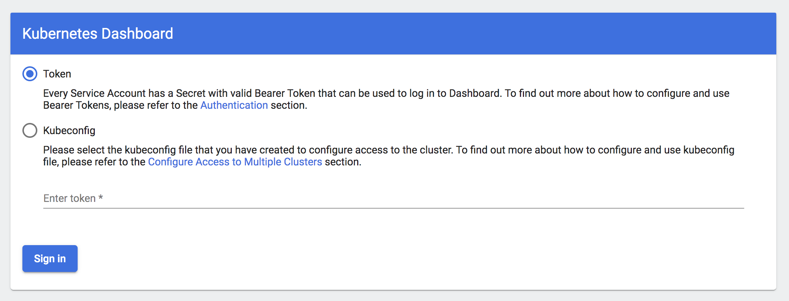

# Authentication and authorization on chaos dashboard

## Summary

We need using authentication and authorization to restrict user's permission and
action.

## Motivation

Users could create, suspend, get, and delete chaos experiments via chaos-dashboard.
But chaos-dashboard does NOT contains and features about permission management, users
could do anything, as long as he could access the chaos-dashboard UI. It is a secure
issue.

We need permission management about:

- access control for **Resource**.
  - User A could create/get IO chaos experiments.
  - User B could create/get Network chaos experiments.
- access control for **Action**.
  - User A could create/get chaos experiments.
  - User B could only get chaos experiments.

## Detailed design

### Login

Users are asked for a `Service Account Token` to login. Like kubernetes dashboard:

### Create new users

System administrators could create user with certain username and permissions,
then a user will be create, and token also shown on the UI.

### Implementation references

Things to do:

- frontend asking user input token to login
- frontend will attach the token while sending requests to backend
- backend will use a certain token to create a new kube client
- backend need support multi-user

> We could references auth module in kubernetes-dashboard while implementing this.

When chaos-dashboard creating user, new `ServiceAccount` will be created, then a
new `RoleBinding` will connect certain `Role` to `ServiceAccount`.

We will provide some pre-set `Role`, like:

- Admin: could create/get any chaos experiments.
- Viewer: could only get chaos experiments.

System administrators could also create their own roles, for advanced permission
control.

### Advantages

- This solution depends on kubernetes rbac, reducing many logics for permission management.
- System administrators could change each user's permission as their requirements,
  it's very flexible.
- Using kubernetes rbac could also restrict permission with `kubectl`.

## Drawbacks

- This solution need chaos-dashboard has permission about create/get/update/delete
  on Role/RoleBinding/Service Account/Secrets.
- Users should understand basic concepts about kubernetes rbac.

## Alternatives

- Implement a full-featured rbac platform inner the chaos-dashboard.
  It's so complex and high-cost, and it is NOT cloud-native at all.

## Unresolved questions

None.
